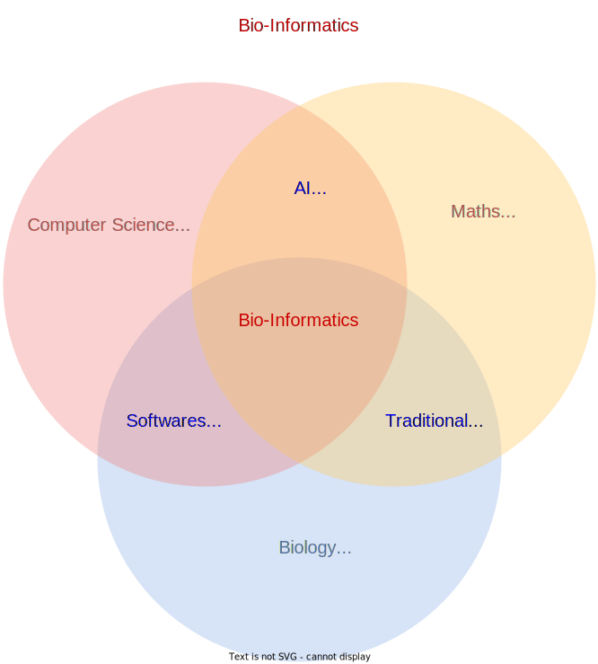
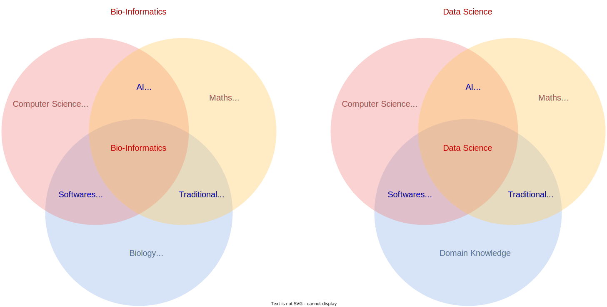

Welcome! I am a post-doctoral researcher in [LarssonLab](https://www.gu.se/en/research/erik-larsson) at the University of Gothenburg. I am an interdisciplinary researcher with expertise in computational science. Currently, I use data science techniques to study cancer patients’ genomic profiles and develop artificial intelligence-based solutions for cancer patients’ specific clinical decision-making.

What I do?  
======

<!---->

New Updates
======
1. Submitted a new research article to Nature Communications.
1. Upadating my CV.

Contact Information
======
* Email: vinod.singh@gu.se
* Institute of Biomedicine, University of Gothenburg.

