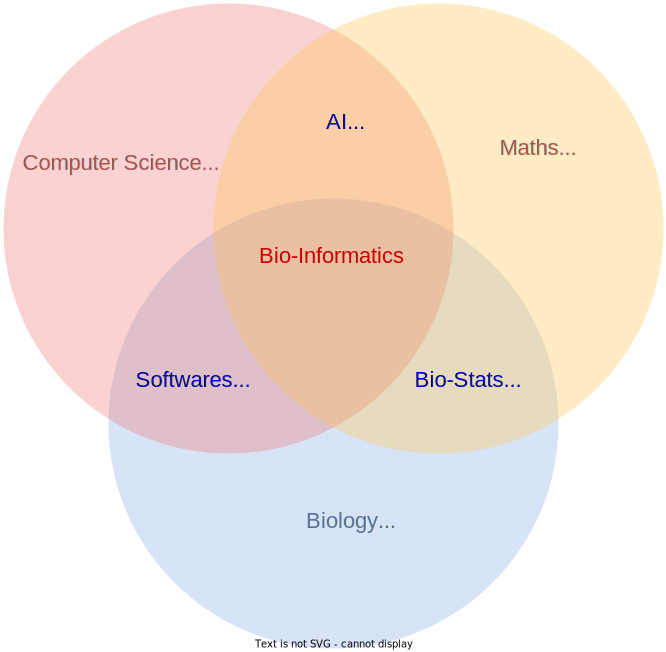
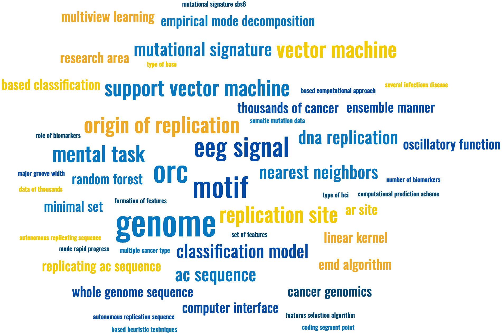

Welcome! I am a research scientist in [Besenbacher research group](https://www.moma.dk/bioinformatics/computational-genomics#people) at Aarhus University, Denmark. As a computational scientist, I unlock insights from cancer patients' genomic data using data science. These insights fuel the development of AI-powered tools for personalized treatment plans, empowering better clinical decisions.

What I do?  
======

Bioinformatics            |  Research Word Cloud
:-------------------------:|:-------------------------:
  |  

<!--  -->

<!---->

<!--!
New Updates
======
1. Submitted a new research article to Nature Communications.
1. Upadating my CV.-->

Contact Information
======
* Email: vinod.acear@gmail.com, vinod.singh@clin.au.dk
* Department of Molecular Medicine, Aarhus University Hospital, Denmark.

