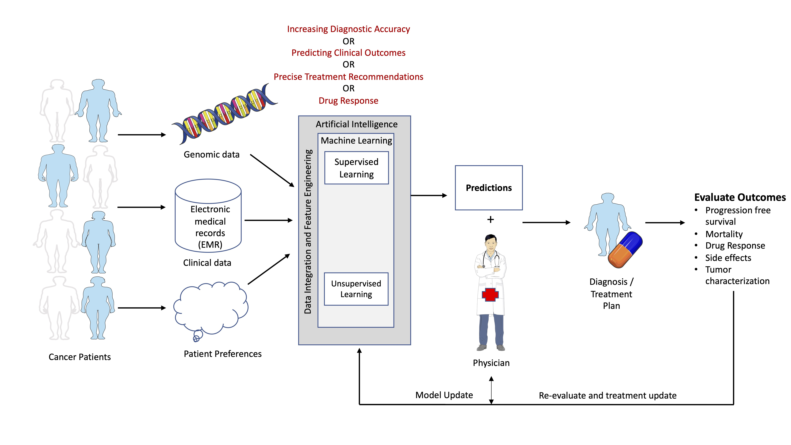

For the last couple of years, I am applying my data science skills and knowledge to develop AI-based systems to recommend the best treatment for cancer patients. Here is a typical framework of my research over the years.

 

For a couple of years, genome sequencing cost has significantly reduced which has made the availability of hundereds of thousands cancer patients' genomic data at affordable price. My job is to integrate and utilise this enormous amount of multimodal data for profiling cancer patients and build Artificial Intelligence-based solutions for their optimal treatment. The performance of AI-based models depends on the features used for profiling cancer patients, hence my group's significant time and energy are consumed in discovering the useful features. We use a lot of dimension-reduction techniques to select useful features or discard noisy features.  The useful features and their impact on the model's performance are discussed and reviewed at regular intervals by a team of researchers which includes oncologists, computational scientists, and biologists. Since our work impacts human subjects, this review and improvement process goes on iteratively at regular intervals.

For many applications related to data integrations, we also use deep learning models. However, in many other applications, where the training dataset is limited or we need proper reasoning for the output, deep learning models are discouraged because a human subject is involved here. But still, we do a feasibility study of these models in our applications. 

