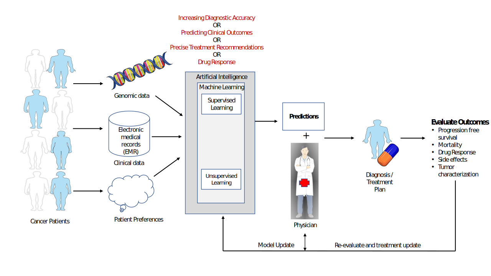

For last couple of years, I am applying my data scince skills and knowledge to develop AI based systems to recommend best treatment for cancer patients. 

# A typical framework of the my research over the years

 

In our work the genomic and clinical medical records data of cancer patients is used to build  Artificial Intelligence-based slutions for cancer treatment. The performance of the machine learning models primarily depends on the quality features used to train them. So, most my work revoles around finding those features. To achieve best treatment outcomes, these models are updated continuously on the availability of new patients data and evaluation of treatment outcomes by a team of experts. 
In our experinces, many times deep-learning techniques work well but these techniques dont give us any clue about the bilogical reaseoning which is most important factor when a human subject is involved. In the whole framework, It is most important to consider best privacy practices while collecting and sharing a patient’s data.

