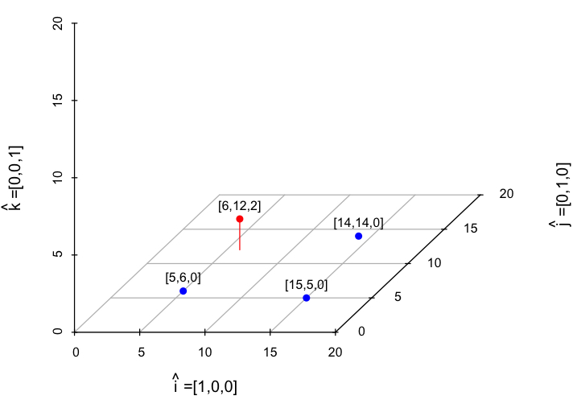

   At many discussion platforms I have found that machine learning enthusiast are always interested to know how AI is helping in precise treatment of cancer patients. I always tell them many approaches which are dependent on the what data we have and in what question we are interested in?  But in this blog I am going to discuss a very interesting application of topic modeling approach which is getting widely popular in cancer patient specific clinical decision making.
  
  In the era of internet there are billions of documents are available online and presenting these documents to the users as collection of word makes no sense to them. So, it is always desirable to represent a documents as mixture of a few limited topics that can be understood by the user. To address this issue the topic modeling techniques of text mining are widely used to automate the document representation into limited number number of topics. Technically, the idea of topic modeling is to reduce the dimension of the documents from total unique word counts in the document database to limited number topics. Lets understand it with the help of an super easy hypothetical example, If we can represent each document in large corpus of documents which is having 4,000 unique words by 3 topics, then we reduced the dimension of a single document from 4,000 to 3. Which means our each document can be represented as point in a 3D orthogonal space, where each topic is representing a axis. The percentage of the 3 topics in a document will represent the exact location of the document in the 3D space. In this 3D space the documents which have similar distribution of topic percentage are clustered together and have many applications such as recommendation of similar document to the user or to the users of similar profile, organizing the documents etc. If you have noticed in this problem, we have not discussed yet, How to calculate the percentage of the topics in each document and How many distinct topics are suitable for our document corpus ?   To answer this question I will give you a brief introduction of non-negative matrix factorization (NMF) technique for dimetnality reduction.   
 

NMF concept
<blockquote>
    
In the figure below you can see here are four points (each point represents a documnet) represented in three dimentions (each dimention represents a topic). 
  

    

 

Each blue point can be represented and linear combination of two vectors ($\hat i$ and $\hat j$), but the red point is the exception which is linear combination of three vectors ($\hat i$, $\hat j$  and $\hat k$) as mentioned below
  
$$
\textcolor{blue}{\begin{bmatrix}
           5 \\
           6 \\
           0 
\end{bmatrix}} 
\begin{align}  = \textcolor{blue}{5}
  \begin{bmatrix}
             1 \\
             0 \\
             0 
  \end{bmatrix}
  + 
  \textcolor{blue}{6} \begin{bmatrix}
             0 \\
             1 \\
             0 
  \end{bmatrix}  =
  \textcolor{blue}{5} \hat i+ \textcolor{blue}{6} \hat j
 \end{align} 
$$ 

<!--
$$ 
\begin{align} &=
  5 \hat i+ 6 \hat j
\end{align}
$$ 
-->  
  
$$
  {\begin{align}
  \textcolor{blue}{\begin{bmatrix}
               15 \\
               5 \\
               0 
    \end{bmatrix}}  = 
    \textcolor{blue}{15} \hat i+ \textcolor{blue}{5} \hat j ,
    \textcolor{blue}{\begin{bmatrix}
               14 \\
               14 \\
               0 
    \end{bmatrix}} = 
    \textcolor{blue}{14} \hat i+ \textcolor{blue}{14} \hat j   ,
    \textcolor{red}{\begin{bmatrix}
               6 \\
               12 \\
               2 
    \end{bmatrix}} = 
    \textcolor{red}{6} \hat i+ \textcolor{red}{12} \hat j + \textcolor{red}{2} \hat k
  \end{align}
$$

But we want to represent our points (documents) by minimum number of dimensions (topics). So, ff we remove the $\hat k$ dimension  of red point then this point can also be represented by two dimensions where other points also lie. This removal of the $\hat k$ dimension here makes perfect sense here, because it is a small quantity compared to the variability of other dimensions and is present in only one sample. There is a high probability this component is created due to noise (irrelevant words in the document) in the data and we do not want to model our topics on the noise. But this step well add up some error. The NMF do the exactly same this as we discussed here, it represent the data in minimum number of dimensionsat the cost of lowest noise using some optimisation strategy. This can be easily understood with the help of equation below.
  
$$
\begin{bmatrix} 5 & 15 & 14 & \textcolor{red}{6} \\
6 & 5 & 14 & \textcolor{red}{12} \\
0 & 0 & 0 & \textcolor{red}{2} \end{bmatrix} =
\begin{bmatrix} 1 & 0 \\
0 & 1 \\
0 & 0  \end{bmatrix}
\times
\begin{bmatrix} 5 & 15 & 14 & \textcolor{red}{6} \\
6 & 5 & 14 & \textcolor{red}{12} \end{bmatrix} + \textcolor{red}{err}
$$ 
  

</blockquote>

<blockquote>   
**Note:** While topic modeling, we can increase the number of topics by considering more unique words of database corpus, but we will need to increase the size of database corpus in exponential manner.
</blockquote>
 
<blockquote> 
Topics summarize corpus of documents, similarly mutational signatures summarize the mutational catalogues of cancer patients. 
</blockquote>

  
  
  
  Let me explain you the logic behind the calculations, the words co-occurring frequently in multiple documents are associated to a topic. The the co-occurrence frequency can be of `N-number` of words, but following precautions should be taken while choosing value of `N'.
  
 * if `N` is too low then we may end up with non-distinguishable topics.
 * if `N` is too high then we may may have majority of zero co-occurrence values (if document corpus size is not big enough) and our topics may be too unique i.e., they may not be seen again in any other document.
 
 The main crux from this is that if we consider high value of `N` to capture more contextual information we will need huge corpus of documents and computational infrastructure to do calculations on very high dimensional co-occurrence matrix of words. So, we have to do the trade off between our data size and value of `N`.  
 
These co-occurrence matrices have a lot of redundant and noisy features, that's why the can be decomposed into lower dimension matrices using dimensional reduction techniques such Non-negative matrix factorization (NMF) or Singular value decomposition (SVD).  
 
 The big tech giants like Google, Microsoft have access to billions of documents and huge computational infrastructure thats why their models for document recommendation performs very well.
 
 
